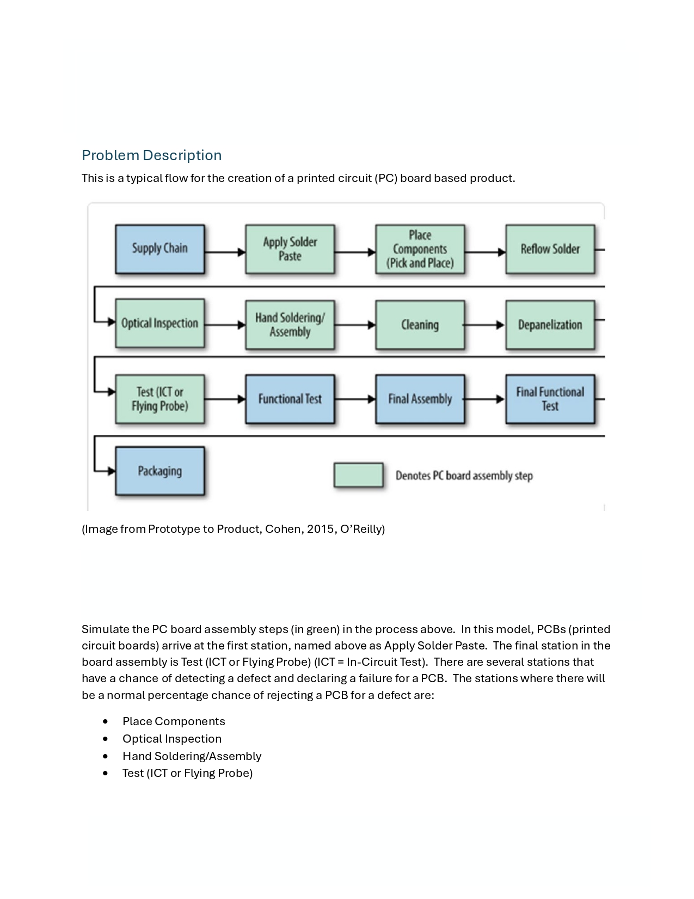
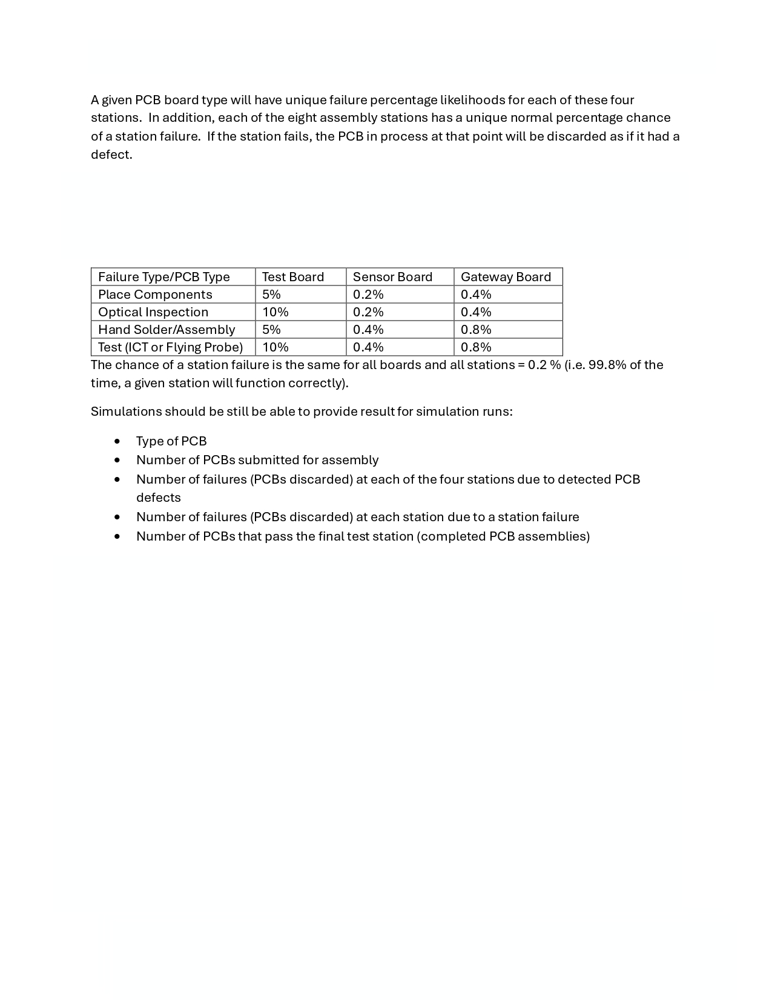

# PCB Simulator

A full-stack simulation application demonstrating model-view-controller (MVC) architecture and object-oriented design. Simulates assembly of a user-defined number and type of printed circuit boards.

---

## Tech Stack

- **Frontend:** JavaScript, React (Vite)
- **Backend:** Java, Spring Boot
- **Database:** PostgreSQL (running in Docker)  
- **Containerization:** Docker

---

## Simulator Problem Description

[]
[]

## Architecture and Design

The backend follows a modular MVC design with the following key classes (zoom in or download SVG to see details):

*Note: Some related AssemblyStation subclasses are omitted for formatting purposes--see HandSolderAssembly for assembly stations that implement PCBCheckstation and ApplySolderPaste for assembly stations that do not.*

[](docs/class-diagram.svg)

---

## Quick Start

You can start the full application (backend + frontend + database) with a single command using the `start.sh` script.

### Steps

1. Clone the repository: `git clone https://github.com/mbasagoitia/pcb-simulator.git`

2. Navigate to the repository: `cd pcb-simulator`

3. Make the start script executable: `chmod +x start.sh`

4. Run the script: `./start.sh`

5. Open `http://localhost:5173` in the browser

## What the script does

1. **Backend configuration**  
   - Checks if `backend/src/main/resources/application.properties` exists.  
   - If not, copies `application.properties.example → application.properties` so Spring Boot knows how to connect to the database.  

2. **Start Docker Postgres container**  
   - Runs the Postgres database in Docker, exposing the port defined in `docker-compose.yml` (default: `5432`).  
   - The database is automatically created on container startup.  
   - Spring Boot will execute `schema.sql` and `data.sql` from `backend/src/main/resources` to create tables and seed initial data.  
   - Postgres is running in Docker on `localhost:5432`.  

3. **Start the Spring Boot backend**  
   - Runs `mvn spring-boot:run` in the `backend` folder.  
   - Backend is accessible at: [http://localhost:8080](http://localhost:8080)  

4. **Start the React frontend**  
   - Installs dependencies (`npm install`) if needed.  
   - Runs the development server (`npm run dev`) in the `frontend` folder.  
   - Frontend is accessible at: [http://localhost:5173](http://localhost:5173)  

### Notes

- All services start together, and logs appear in your terminal.  
- Press **Ctrl + C** to stop the frontend and backend processes.  
- The Docker Postgres container will keep running; stop it with:  
  ```bash
  docker compose down
