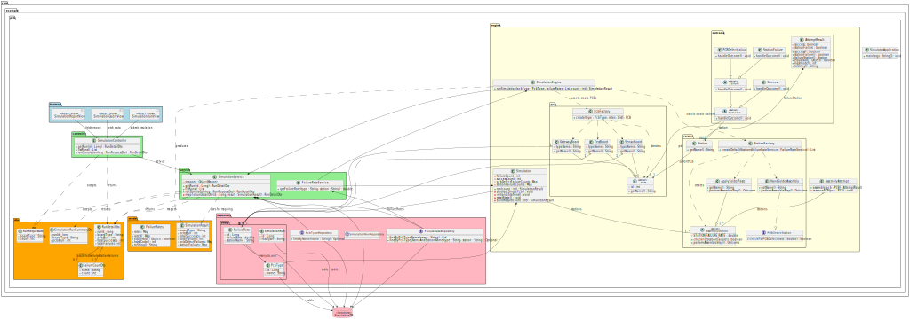

# PCB Simulator

A full-stack simulation application demonstrating model-view-controller (MVC) architecture and object-oriented design. Simulates assembly of a user-defined number and type of printed circuit boards.

---

## Tech Stack

- **Frontend:** JavaScript, React (Vite)
- **Backend:** Java, Spring Boot
- **Database:** PostgreSQL (running in Docker)  
- **Containerization:** Docker

---

## Architecture & Design

The backend follows a modular design with the following key classes:

---

## Quick Start

You can start the full application (backend + frontend + database) with a single command using the `start.sh` script.

### Steps

1. Clone the repository: `git clone https://github.com/mbasagoitia/pcb-simulator.git`

2. Navigate to the repository: `cd pcb-simulator`

3. Make the start script executable: `chmod +x start.sh`

4. Run the script: `./start.sh`

What the script does:

1. Backend configuration
- Checks if backend/src/main/resources/application.properties exists
- If not, copies application.properties.example → application.properties so Spring Boot knows how to connect to the database

2. Start Docker Postgres container
- Runs the Postgres database in Docker, exposing the port defined in your docker-compose.yml
- The schema.sql script automatically creates the necessary tables and the data.sql seeds the database
- Postgres is running in Docker on localhost:5432.

3. Start the Spring Boot backend
- Runs `mvn spring-boot:run` in the backend folder

- Backend is accessible at: http://localhost:8080
- Start the React frontend

4. Installs dependencies (npm install)
- Runs the development server (`npm run dev`) in the frontend folder
- Frontend is accessible at: http://localhost:5173

### Notes

- All services start together and logs appear in your terminal
- Press Ctrl + C to stop the frontend and backend processes
- The Docker Postgres container will keep running; stop it with `docker compose down`
- If you want a fresh database, you can remove the container and volume: `docker compose down -v`